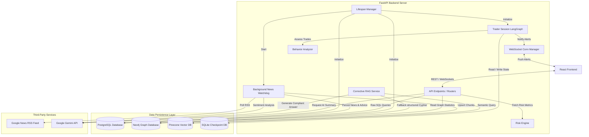

# NiftyMind Backend Architecture: HLD & LLD

This document outlines the High-Level Design (HLD) and Low-Level Design (LLD) of the NiftyMind backend. NiftyMind is a GenAI-powered portfolio intelligence and trading analytics platform designed to analyze investor behavior, track risks, aggregate news sentiment, and provide compliant financial observations using Google Gemini.

---

## 1. High-Level Design (HLD)

### 1.1 Core Objectives
- **Behavioral Analysis**: Detect trading anomalies (e.g., FOMO, revenge trading, overtrading).
- **Risk Metrics**: Calculate portfolio health, concentration, and diversification scores.
- **AI Portfolio Advisor**: Generate compliant portfolio evaluations via RAG without providing direct financial advisory (SEBI compliance).
- **Sentiment watchdog**: Aggregates RSS financial feeds, runs sentiment checks via LLM, updates targets, and indexes news into vector stores.

---

### 1.2 System Architecture Topology

The following diagram illustrates the relationship between components, database engines, and third-party APIs:



---

### 1.3 Database Topology & Storage Design

NiftyMind utilizes a specialized multi-database storage architecture:

1. **PostgreSQL (Transactional Engine)**
   - **Purpose**: Persists structured relational data like users, portfolios, holdings, transaction history, RSS news articles, sentiment analyses, and AI suggestions.
   - **Access Patterns**:
     - *SQLAlchemy ORM*: Used primarily for user account registrations and session metadata logging.
     - *Raw `asyncpg` Pool*: Bypasses ORM overhead to perform high-throughput transactions (e.g., executing buys/sells and dynamically recalculating average cost bases).

2. **Neo4j (Knowledge Graph Database)**
   - **Purpose**: Models company nodes, sector structures, corporate actions (e.g., dividends, buybacks), earnings events, financial metrics, and competitor relations.
   - **Access Patterns**: Dynamic Cypher queries parameterized for company overview lookups and sector mapping fallbacks.

3. **Pinecone (Serverless Vector Database)**
   - **Purpose**: High-speed semantic text retrieval. Stores document chunks from corporate earnings transcripts and AI news summaries.
   - **Access Patterns**: Queries query-embedded questions using Pinecone serverless indices, matching dimensional vectors representing textual semantic space.

4. **SQLite (LangGraph checkpointer)**
   - **Purpose**: Acts as a state checkpointer for LangGraph agent sessions (`SqliteSaver`), saving full execution histories and state frames locally.

---

## 2. Low-Level Design (LLD)

### 2.1 Backend Code Directory Structure

```
backend/
├── app/
│   ├── analytics/             # Optional analytics components
│   ├── api/
│   │   └── routes/            # REST and WebSocket Endpoints
│   ├── auth/                  # Password hashing & JWT dependencies
│   ├── core/                  # Structured logging & exceptions setup
│   ├── db/
│   │   ├── crud/              # SQL queries (asyncpg, sqlalchemy)
│   │   └── models/            # SQLAlchemy database schemas
│   ├── graph/                 # Neo4j client connection and schema query services
│   ├── graphs/                # LangGraph session state machine definitions
│   ├── middleware/            # Request ID tracing middleware
│   ├── models/                # Pydantic schemas and dataclasses
│   ├── rag/                   # Document loaders, splitters, & RAG routing
│   ├── services/              # Core business services and watchdog scheduler
│   ├── websockets/            # WS connection manager for guardrails
│   └── config.py              # Application environment configurations
├── main.py                    # Server startup entry point & background schedulers
└── requirements.txt           # Package specifications
```

---

## 3. Core Modules & Services Detailed

### 3.1 AI Portfolio Advisor & Corrective RAG (CRAG)
The Advisor orchestrates a multi-step pipeline using the `CorrectiveRAGService` to formulate a holistic SEBI-compliant advice report:

```
[Advisor Request] 
       │
       ├──► Sort holdings by total value.
       ├──► Query CRAG in parallel for top positions.
       │      │
       │      ├──► 1. Query Pinecone Vector Store.
       │      │
       │      ├──► 2. Compute Confidence Score (Average vector score).
       │      │
       │      └──► 3. Determine Routing Mode:
       │             ├──► Vector Only (Score >= 0.75)
       │             ├──► Hybrid (0.50 <= Score < 0.75) -> Pinecone + Neo4j Graph Cypher
       │             └──► Graph Fallback (Score < 0.50) -> Neo4j Graph Cypher
       │
       ├──► Gather Portfolio Risk Metrics (HHI Diversification, Sector exposure).
       ├──► Gather Behavioral Warning Flags (Overtrading, Sizing anomalies).
       │
       ▼
[Gemini Context Assembly] ──► [System Prompt Enforcement] ──► [Structured Markdown Observation Report]
```

- **RAG Routing Logic (`corrective_rag.py`)**:
  - `vector_only`: Renders context using vectorized transcript excerpts.
  - `hybrid`: Combines text excerpts with JSON dump of Neo4j graph entities.
  - `graph_fallback`: Relies strictly on Neo4j when semantic vector search returns poor results. It maps natural questions to Cypher query outputs using keywords (e.g. "dividend", "buyback", "margin", "bank", "it").

---

### 3.2 Trader Session State Machine (LangGraph)
Defined in `app/graphs/trader_session.py`, this state machine tracks active trader sessions in real-time, executing nodes sequentially when a new trade is posted:

```
         START
           │
           ▼
   +─────────────────+
   │  process_trade  │ ◄── Adds trade (OPEN/CLOSE), updates total PnL,
   +─────────────────+     consecutive wins/losses, open counts.
           │
           ▼
   +─────────────────+
   │ detect_behavior │ ◄── Runs BehaviorAnalyzer; if HIGH severity
   +─────────────────+     is flagged, activates guardrail switches.
           │
           ▼
          END
```
- **State Persistence**: The session uses `SqliteSaver` bound to the local SQLite database configured at startup.
- **WebSocket Alerts**: The manager triggers WebSocket broadcasts if new flags are detected to notify the UI instantly.

---

### 3.3 Behavioral Analyzer Engine
The `BehaviorAnalyzerService` evaluates trading patterns against strict mathematical rules:

| Behavioral Flag | Severity | Trigger Conditions |
| :--- | :--- | :--- |
| `EXCESSIVE_CONCENTRATION` | **HIGH** | A single asset holds > 30% weight of total portfolio value. |
| `OVERTRADING` | **MEDIUM** | Transaction count exceeds 5 operations within any 30-minute window. |
| `REVENGE_TRADE` | **HIGH** | Re-entry BUY on a symbol within 5 minutes of a SELL with >1.5x trade value, or trading after a streak of 3+ consecutive losses. |
| `FOMO` | **MEDIUM** | Quick re-entry on a symbol within 5 minutes of closing a losing position. |
| `POSITION_SIZING` | **HIGH / MEDIUM** | Position unit size exceeds 2x the historical average of previous open trades, or a revenge sizing increase of 1.5x after a loss. |

---

### 3.4 Watchdog News Aggregator
Runs asynchronously in the background (`main.py`):
- Runs every 30 minutes, querying active stock tickers.
- Fetches XML RSS feed from Google News.
- Invokes `NewsSentimentService` using Gemini to extract sentiment (BULLISH, BEARISH, NEUTRAL) and price impact (HIGH, MEDIUM, LOW).
- Automatically updates database records for target levels (Q1-Q4 targets), suggested stop losses, and outputs fact chunks into Pinecone.

---

### 3.5 Portfolio Risk Engine
Calculates index scores representing portfolio stability:
- **Diversification Score**: Measures concentration using the Herfindahl-Hirschman Index (HHI):
  $$HHI = \sum (Weight_i)^2$$
  The diversification score is scaled between 0 and 100:
  $$Score = \max\left(0, 100 - \frac{HHI}{100}\right)$$
- **Overweight Position analysis**: Flags a position as overweight if its allocation exceeds double the average holding allocation ($2 \times \frac{100}{N}\%$) and represents more than 20% of the entire portfolio.

---

### 3.6 Relational Database Schema (PostgreSQL)

```sql
-- Users Table
CREATE TABLE users (
    id UUID PRIMARY KEY DEFAULT gen_random_uuid(),
    email VARCHAR(255) UNIQUE NOT NULL,
    hashed_password VARCHAR(255) NOT NULL,
    full_name VARCHAR(255),
    is_active BOOLEAN DEFAULT TRUE,
    is_verified BOOLEAN DEFAULT FALSE,
    created_at TIMESTAMP WITH TIME ZONE DEFAULT CURRENT_TIMESTAMP,
    updated_at TIMESTAMP WITH TIME ZONE DEFAULT CURRENT_TIMESTAMP
);

-- User Sessions Table
CREATE TABLE user_sessions (
    id UUID PRIMARY KEY DEFAULT gen_random_uuid(),
    user_id UUID REFERENCES users(id) ON DELETE CASCADE NOT NULL,
    session_id VARCHAR(50) UNIQUE NOT NULL,
    label VARCHAR(255),
    is_active BOOLEAN DEFAULT TRUE,
    created_at TIMESTAMP WITH TIME ZONE DEFAULT CURRENT_TIMESTAMP,
    updated_at TIMESTAMP WITH TIME ZONE DEFAULT CURRENT_TIMESTAMP
);
CREATE INDEX ix_user_sessions_user_id_is_active ON user_sessions(user_id, is_active);

-- Portfolios Table
CREATE TABLE portfolios (
    id UUID PRIMARY KEY,
    user_id UUID REFERENCES users(id) ON DELETE CASCADE NOT NULL,
    name VARCHAR(255) NOT NULL,
    created_at TIMESTAMP DEFAULT CURRENT_TIMESTAMP,
    updated_at TIMESTAMP DEFAULT CURRENT_TIMESTAMP
);

-- Holdings Table
CREATE TABLE holdings (
    id UUID PRIMARY KEY,
    portfolio_id UUID REFERENCES portfolios(id) ON DELETE CASCADE NOT NULL,
    symbol VARCHAR(50) NOT NULL,
    quantity NUMERIC NOT NULL,
    average_buy_price NUMERIC NOT NULL,
    created_at TIMESTAMP DEFAULT CURRENT_TIMESTAMP,
    updated_at TIMESTAMP DEFAULT CURRENT_TIMESTAMP,
    UNIQUE (portfolio_id, symbol)
);

-- Portfolio Transactions
CREATE TABLE portfolio_transactions (
    id UUID PRIMARY KEY,
    portfolio_id UUID REFERENCES portfolios(id) ON DELETE CASCADE NOT NULL,
    symbol VARCHAR(50) NOT NULL,
    quantity NUMERIC NOT NULL,
    price NUMERIC NOT NULL,
    transaction_type VARCHAR(10) NOT NULL, -- BUY or SELL
    timestamp TIMESTAMP DEFAULT CURRENT_TIMESTAMP
);

-- Holding Suggestions (Stop Loss, Risk indicators, Targets)
CREATE TABLE holding_suggestions (
    id SERIAL PRIMARY KEY,
    portfolio_id UUID REFERENCES portfolios(id) ON DELETE CASCADE NOT NULL,
    symbol VARCHAR(50) NOT NULL,
    suggested_stop_loss NUMERIC,
    risk_signal VARCHAR(20) NOT NULL, -- BUY, SELL, HOLD
    reasoning TEXT,
    quarterly_targets JSONB,
    created_at TIMESTAMP DEFAULT CURRENT_TIMESTAMP,
    updated_at TIMESTAMP DEFAULT CURRENT_TIMESTAMP,
    UNIQUE (portfolio_id, symbol)
);

-- Stock News
CREATE TABLE stock_news (
    id UUID PRIMARY KEY DEFAULT gen_random_uuid(),
    symbol VARCHAR(50) NOT NULL,
    title TEXT NOT NULL,
    content TEXT,
    source VARCHAR(100),
    url TEXT,
    published_at TIMESTAMP,
    created_at TIMESTAMP DEFAULT CURRENT_TIMESTAMP
);

-- News Sentiment Analyses
CREATE TABLE news_analyses (
    id UUID PRIMARY KEY DEFAULT gen_random_uuid(),
    news_id UUID REFERENCES stock_news(id) ON DELETE CASCADE UNIQUE NOT NULL,
    symbol VARCHAR(50) NOT NULL,
    sentiment VARCHAR(20) NOT NULL, -- BULLISH, BEARISH, NEUTRAL
    impact_level VARCHAR(20) NOT NULL, -- HIGH, MEDIUM, LOW
    impact_type VARCHAR(50) NOT NULL, -- PRICE_SENSITIVE, REGULATORY, etc.
    summary TEXT,
    price_effect TEXT,
    created_at TIMESTAMP DEFAULT CURRENT_TIMESTAMP
);
```

---

### 3.7 Knowledge Graph Schema (Neo4j)

- **Node Types**:
  - `(:Company {ticker: string, name: string, exchange: string, index: string})`
  - `(:Sector {name: string})`
  - `(:EarningsEvent {id: string, quarter: string, date: string, transcript_id: string})`
  - `(:FinancialMetric {id: string, type: string, value: float, unit: string, direction: string})`
  - `(:CorporateAction {id: string, type: string, amount: float, unit: string, subtype: string, quarter: string})`

- **Relationships**:
  - `(:Company)-[:BELONGS_TO]->(:Sector)`
  - `(:Company)-[:REPORTED]->(:EarningsEvent)`
  - `(:EarningsEvent)-[:HAS_METRIC]->(:FinancialMetric)`
  - `(:Company)-[:DECLARED]->(:CorporateAction)`
  - `(:Company)-[:COMPETES_WITH]->(:Company)`
